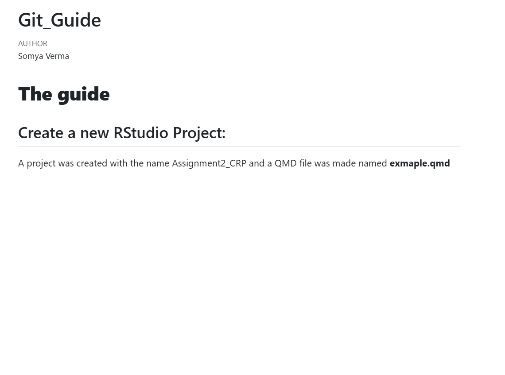
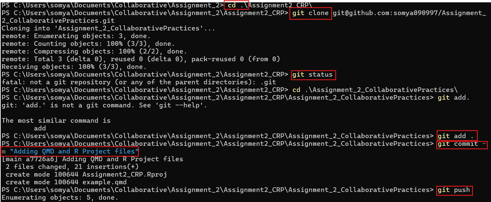
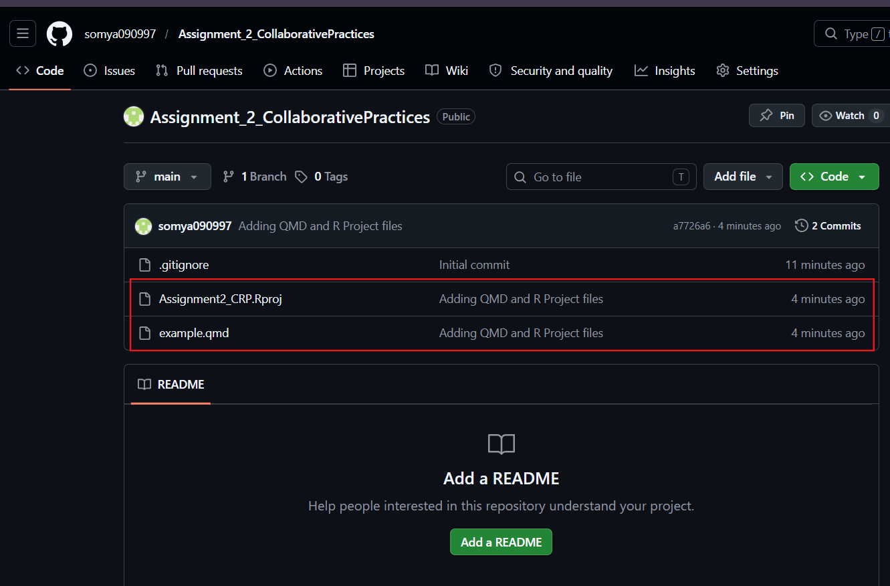
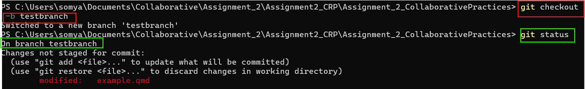
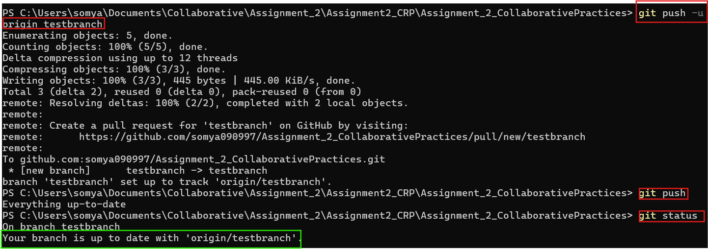
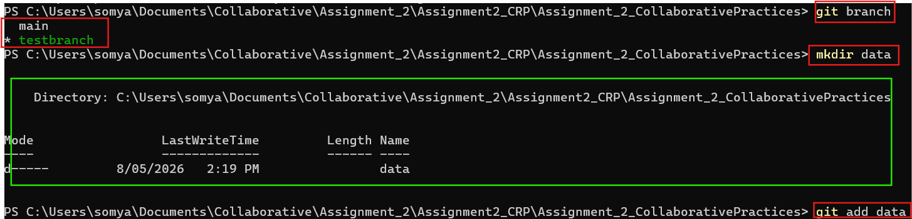
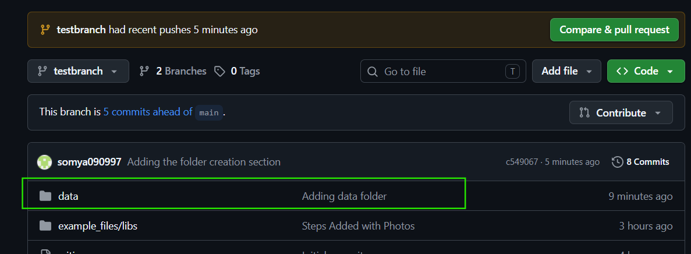
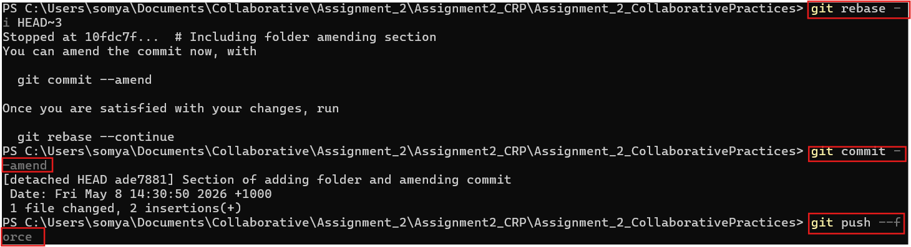
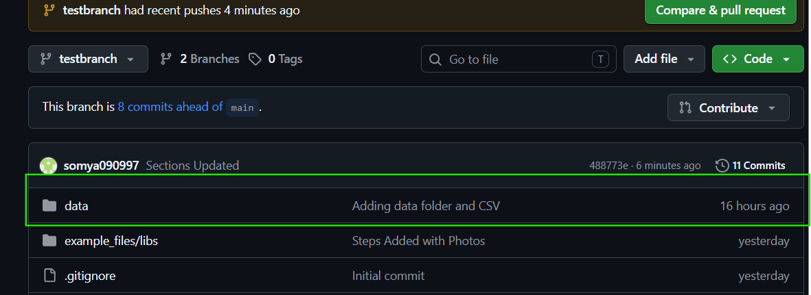

# **The guide**

## Create a new RStudio Project:

A project was created with the name Assignment2_CRP and a QMD file was made named **exmaple.qmd** and was rendered to the HTML format. As seen in @fig-Rendered_file

{#fig-Rendered_file}

## Initialise this folder as a git repository: Commnad Line

The following steps were taken in order to push the local repository to the remote and initialising Git through the command line. The commands can be seen in @fig-InitialisingGit

**cd .Assignment2_CRP**

Changed into the project directory.

**git clone**

Cloned the remote GitHub repository to the local machine.

**git status**

Checked the current repository status and tracked files.

**git add .**

Staged all project files for commit.

**git commit -m "Adding QMD and R Project files"**

Created a commit containing the QMD and R project files.

**git push**

Uploaded local commits to the GitHub repository.

{#fig-InitialisingGit}

### Local files Pushed to Remote Git Repository

Below in figure @fig-PushingtoGit the files pushed from the local folder is reflected with the `git commit` message pushed through the command line.

{#fig-PushingtoGit}

## Adding a New Branch: testbranch

With help of the `git checkout -b testbranch` we not only create a new branch but also switch. The alternative to this can be `git switch -c testbranch`. As shown in the @fig-CreatingBranch

{#fig-CreatingBranch}

What issues can come while creating a branch? You can refer to the below picture @fig-Addabranch If you used the general `git push`, it will not work and will not show your commit. As for the first time, the branch as to be established with an upstream. Hence we will have to use `git push -u origin testbranch` or we can also try `git push --set-upstream origin testbranch`.

Post this step, you can do the general git_push command to push changes in the testbranch.

{#fig-Addabranch}

## Adding a folder named "data"

Using the command `mkdir` a folder named `data` was added that can be seen in the below @fig-Creatingfolder can be seen. This folder had the csv file from Assignment1. 

The regular git add, git commit and git push commands were used to make changes reflect in remote repository as well. It can be seen in @fig-AddingFolder

Note: Always check which branch you are working on or making the folder through `git branch`

{#fig-Creatingfolder}

{#fig-AddingFolder}

##### Amending the commit

We will check our git log of commits with help of `git log --online`. In the below @fig-Amendingcommit you will see `git rebase -i HEAD~3` has been used to locate the commit to amend the commit message from "**Adding Folder**" (seen in @fig-AddingFolder ) to "**_Adding data folder with csv data_**". 

Then `git commit --amend` is used to change the commit message within VIM. Once the message is edited, save it by typing `:wq` that saves the changes and gets back to the command line. 

Why do we use `git push --force`? After using `git commit --amend`, the commit hash changed because Git created a new version of the commit. A normal push was rejected since the remote repository still contained the old commit history. Therefore, `git push --force` was required to overwrite the remote history with the amended commit.

{#fig-Amendingcommit}

Check the @fig-Amendedcommit to see the change in comment. 

{#fig-Amendedcommit}
