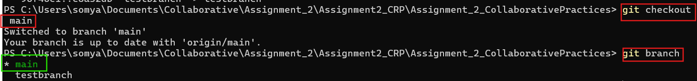

# **The guide**

## Create a new RStudio Project:

A project was created with the name Assignment2_CRP and a QMD file was made named **exmaple.qmd** and
was rendered to the HTML format. As seen in @fig-Rendered_file

{#fig-Rendered_file}

## Initialise this folder as a git repository: Commnad Line

The following steps were taken in order to push the local repository to the remote and initialising Git through the command line. The commands can be seen in @fig-InitialisingGit

**cd .Assignment2_CRP**

Changed into the project directory.

**git clone**

Cloned the remote GitHub repository to the local machine.

**git status**

Checked the current repository status and tracked files.

**git add .**

Staged all project files for commit.

**git commit -m "Adding QMD and R Project files"**

Created a commit containing the QMD and R project files.

**git push**

Uploaded local commits to the GitHub repository.

{#fig-InitialisingGit}

### Local files Pushed to Remote Git Repository

Below in figure @fig-PushingtoGit the files pushed from the local folder is refelcted with the **git commit** message pushed through the command line. 

{#fig-PushingtoGit}

## Switching To Main To Create Conflict 
{#fig-Switchingtomain}

Below in @fig-Switchingtomain we can see that we are now working. As we make changes in the `main branch` it will cause conflict with the other **testbranch**

